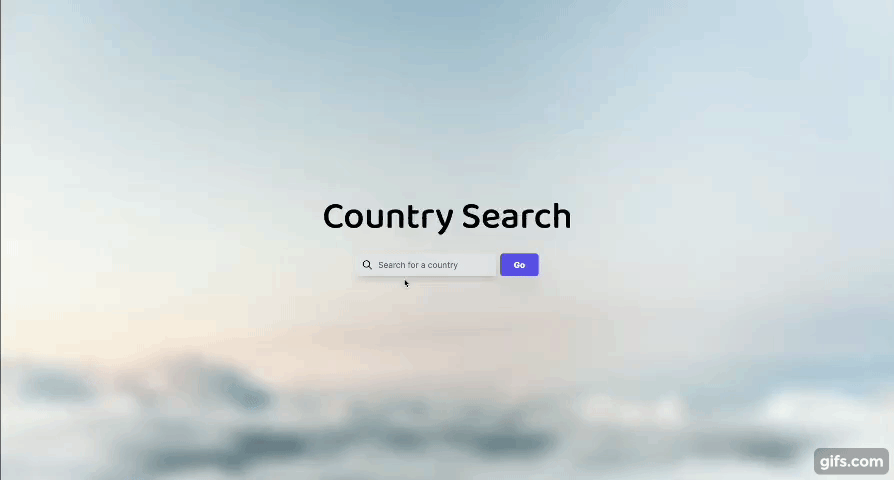
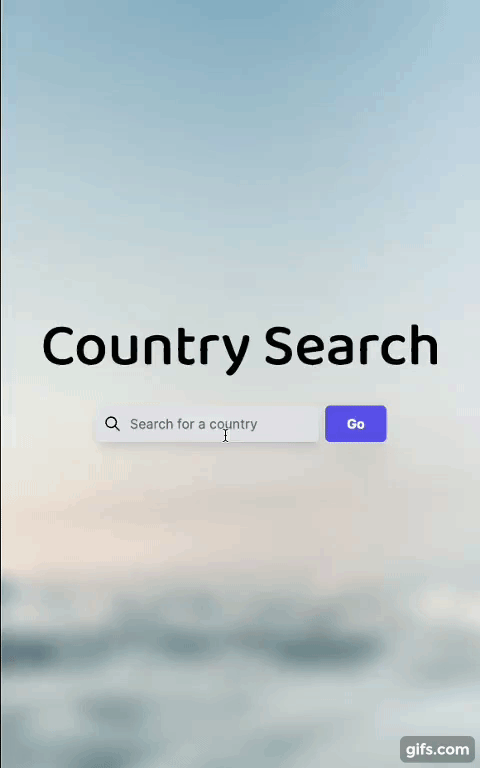

# 🌍 Country Search

This web application provides detailed information about countries. Users can search for a country and receive an array of data.
<!-- , from general information to images generated by DALL·E AI API. -->

## 📸 Screenshots 

  
  

<!--  -->

## 🌟 Features 

- **Detailed Country Information**: Access data about countries, such as capital, language, currency, and a brief description about the country.

## 🚀 Tech Stack 

- **Frontend**: NextJS, TypeScript, Tailwind
- **Backend**: MongoDB
<!-- - **API Integrations**:  -->
